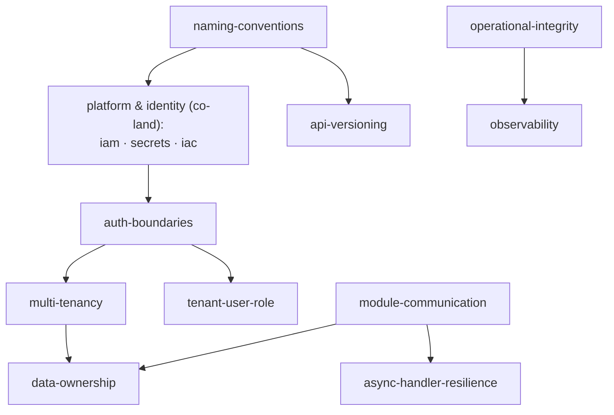

# Bootstrap Decisions

A decision tree for new projects. Skip the ritual; answer the questions in order, and the boundary order falls out.

---

## 1. Shape of the system

- **Monolithic backend with a database?** Apply auth, multi-tenancy, naming, IaC, data-integrity, quality-security from day 1.
- **Microservices?** Add module-communication and data-ownership as cross-service contracts. Each service still applies the rest.
- **Serverless-first / edge-only?** Operational-integrity and async-resilience are still primary. IAM matters more than usual. IaC matters more than usual.
- **Mobile or web client only?** Apply auth, naming, engineering-practices. The other boundaries are inherited from whatever backend you call.

---

## 2. Auth provider

- **Will the system ever change providers?** Yes (most cases) → apply auth-boundaries strictly. Provider isolation pays off.
- **Locked to one provider permanently?** Document the lock. The boundary still applies; the cost of provider lock-in is known and accepted.

---

## 3. Tenancy

- **Single tenant ever?** Skip multi-tenancy and tenant-user-role boundaries.
- **B2B SaaS with shared infrastructure?** Apply both. Pick the isolation level (shared table, schema-per-tenant, database-per-tenant) based on compliance and deletion cost.
- **B2B SaaS with per-customer deployments?** Apply both, but the isolation is implicit at the deployment layer.

---

## 4. Cross-module structure

- **One module / small surface?** Module-communication and data-ownership are aspirational; revisit when the second module appears.
- **Several modules from the start?** Apply both immediately. Cross-module events from day 1 are cheap; retrofitting events into a tangled monolith is expensive.

---

## 5. Infrastructure

- **Greenfield cloud account?** Apply IaC and IAM strictly. No manual resources except documented crown jewels.
- **Existing cloud account with manual resources?** Import critical resources into IaC under lifecycle protection. Migrate the rest progressively.

---

## 6. Quality gates

- **No CI yet?** Set up pre-commit and CI together with the same checks. Don't ship without the gates.
- **Existing CI without security or naming checks?** Add them as required checks; don't make them advisory.

---

## 7. Dependencies between boundaries

The boundaries are not strictly sequential, but some depend on others. Land the dependencies before the dependents.

Arrow direction reads "land before"; the `platform` node reads "co-land as one decision".

**Also day-1 floor — no graph dependencies, but day-1 cheap and day-N expensive:** `testing`, `logging-and-error-handling`, `quality-security`, `engineering-practices`. **Triggered by context, not by graph position:** `production-data-integrity` (the moment a persistent store has customer data), `cloud-deployment-posture` (before first customer-facing traffic).

Use the map to identify what depends on what; then sequence based on the answers above.

---

## What this is not

A checklist to complete in sequence. A guide to the order in which decisions matter. The boundaries are the constraints; this document is the order in which to encounter them.
